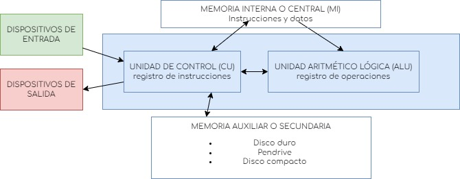

    +++date = "2025-02-14T23:46:38+01:00"
draft = true
title = "Está mi dinero seguro en los bancos?"
subtitles = [ "En qué situaciones mi dinero está garantizado?", "Cómo puedes asegurar la mayor cantidad de dinero posible",]
description = "Descubre en qué situaciones tu dinero está a salvo."
keywords = [ "banco", "bancos",]
tags = [ "entidades", "bancos", "expansión de negocios",]
categories = "entidades"
img = "qué-es-un-fondo-de-garantía-de-depósitos.webp"
imgDescription = "Hucha de cerdito rosa, con monedas al lado"
type = "post"
metaDesc = ""
author = "CR"
+++

    > _"El ser humano no valora lo que tiene hasta que lo pierde"._  

    Y m�s cuando lo que pierdes es tu cimiento econ�mico que has ido construyendo a�o tras a�o. Por hoy, aparte de valorar lo que tenemos, debemos tambi�n preguntarnos por la seguridad de aquellos bienes que guardamos en los bancos, para evitar situaciones como la anterior.

    ## �Est� asegurado mi dinero en los bancos?

    La respuesta, como cabe imaginar, depende de m�ltiples factores que vamos a explorar a continuaci�n. Como responderemos a la pregunta con generalidad, animamos al lector a investigar su caso particular para confirmar lo dicho en el art�culo.

    ### En funci�n de tu geograf�a

    Las pol�ticas econ�micas var�an en funci�n del pa�s en el que nos encontremos. Ahora bien, en la Uni�n Europea hay uniformidad respecto a este tema: todos los bancos que operen en la UE est�n obligados a pertenecer a un ___.

    ### En funci�n de la cantidad de ahorros
    

    ACUERDATE DE PONER C�MO CITAR EL ART�CULO AL FINAL PARA OBTENER BACKLINKS
    ### En funci�n del servicio bancario*

    El Fondo de Garant�as de Dep�sitos es una entidad que a�ade una seguridad adicional al dinero en cuentas corrientes y dep�sitos.

    ## En caso positivo, �cu�nto dinero tengo asegurado?

    En la Uni�n Europea, hasta 100.000 euros por titular y entidad est�n respaldados en caso de solvencia del banco. Esto quiere decir que a distintos bancos, tendremos m�s margen para salvar nuestro dinerillo.

    ## C�mo puedes asegurar la mayor cantidad de dinero posible

    Ahora la pregunta es, dentro de lo posible, c�mo podemos mantener a salvo nuestros fondos ante solvencias de bancos. Estos son varios consejos:

    ### Credulidad de los bancos europeos

    Como hemos mencionado antes, los bancos europeos est�n obligados a pertenecer a alg�n __. Por lo tanto, mientras tu dinero est� depositado en bancos europeos no hay de que preocuparse.

    ### Divide y vencer�s

    Como "investigar si en otros sitios te dan garant�as por cada banco"